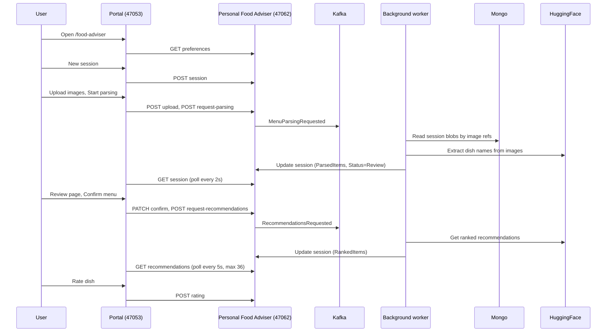

# Food Adviser - Detailed Workflow

End-to-end flow from user actions through Portal, Personal Food Adviser API, Kafka, and back.

---

## 1. Overview

---

## 2. Step-by-step flow

### 2.1 Food Adviser home (`/food-adviser`)

| Step | Who | What |
|------|-----|------|
| 1 | User | Opens Food Adviser from sidebar (link to `/food-adviser`). |
| 2 | Portal (ClientApp) | Renders `FoodAdviserHomePage`. On mount, calls `foodAdviserApi.getPreferences(u)`. |
| 3 | Portal (ClientApp) | Request: `GET /api/foodAdviser/preferences` (relative to Portal origin, for example `http://localhost:47053`). |
| 4 | Portal (WebUI) | `FoodAdviserController.GetPreferences` receives request, forwards to wrapper/client code. |
| 5 | Portal (Infrastructure) | `PersonalFoodAdviserClient` calls PFA: `GET {PersonalFoodAdviserOptions.Url}/api/V1/Preferences` with JWT. |
| 6 | Personal Food Adviser | `PreferencesController.Get` loads preferences from Mongo by user id, returns 200 with body or 204. |
| 7 | User | Optionally edits likes/dislikes and clicks Save -> `PUT /api/foodAdviser/preferences` -> PFA `PUT /api/V1/Preferences` -> Mongo updated. |
| 8 | User | Clicks `New session` -> `navigate("/food-adviser/session/new")`. |

---

### 2.2 New session (`/food-adviser/session/new`)

| Step | Who | What |
|------|-----|------|
| 1 | Portal (ClientApp) | Renders `FoodAdviserSessionNewPage`. No session yet, shows `New session` button. |
| 2 | User | Clicks `New session`. |
| 3 | ClientApp | `foodAdviserApi.createSession(u)` -> `POST /api/foodAdviser/session`. |
| 4 | Portal | Controller -> PFA `POST /api/V1/MenuSession`. |
| 5 | PFA `MenuSessionService.CreateAsync` | Inserts new `MenuSession` in Mongo (`UserId`, `Status=Uploaded`), returns session with id. |
| 6 | ClientApp | `setSession(data)`; UI shows file input and `Start parsing` (disabled until files selected). |
| 7 | User | Selects 1-10 images, clicks `Start parsing`. |
| 8 | ClientApp | `foodAdviserApi.uploadSessionImages(session.id, files, u)` -> `POST /api/foodAdviser/session/{id}/upload` with multipart form. |
| 9 | Portal | Controller -> PFA `POST /api/V1/MenuSession/{id}/upload`; PFA stores blobs, returns image ref ids. |
| 10 | ClientApp | Then `foodAdviserApi.requestParsing(session.id, u)` -> `POST /api/foodAdviser/session/{id}/request-parsing`. |
| 11 | Portal | Controller -> PFA `POST /api/V1/MenuSession/{id}/request-parsing`. |
| 12 | PFA `MenuSessionService.RequestParsingAsync` | Produces `MenuParsingRequestedEvent` to Kafka topic `personal-food-adviser_menu-parsing-requested`. Returns 202 Accepted. |
| 13 | ClientApp | Sets `parsing = true`; starts polling. |

**Polling (SessionNew)**

- Every **2 seconds**: `foodAdviserApi.getSession(sessionId, u)` -> `GET /api/foodAdviser/session/{id}` -> PFA `GET /api/V1/MenuSession/{id}`.
- When response has `status === "Review"`: stop polling, `navigate(/food-adviser/session/{id}/review)`.
- When `status === "Failed"`: stop polling, show same page (parsing failed).
- Polling stops when user leaves the page (effect cleanup) or status becomes Review/Failed.

**Backend (async, while polling)**

| Step | Who | What |
|------|-----|------|
| 1 | PFA `FoodAdviserEventListenerService` | Consumes `personal-food-adviser_menu-parsing-requested` (consumer group `personal-food-adviser-parsing`). |
| 2 | `MenuParsingProcessor.ProcessAsync` | Loads session, sets `Status=Parsing`, loads image blobs by `ImageRefs` from Mongo. |
| 3 | | Calls `HuggingFaceClient.ExtractDishNamesFromImagesAsync`. |
| 4 | | Sets `ParsedItems`, sets `Status=Review`, saves to Mongo (or `Status=Failed` on failure). |

---

### 2.3 Review menu (`/food-adviser/session/{sessionId}/review`)

| Step | Who | What |
|------|-----|------|
| 1 | ClientApp | On mount, `foodAdviserApi.getSession(sessionId, u)` -> loads session; sets items from `data.parsedItems`, `trySomethingNew` from session. |
| 2 | User | Edits/removes/adds items, optionally checks `Try something new`, clicks `Confirm menu`. |
| 3 | ClientApp | `foodAdviserApi.confirmMenu(sessionId, items, trySomethingNew, u)` -> `PATCH /api/foodAdviser/session/{id}/confirm`. |
| 4 | Portal | Controller -> PFA `PATCH /api/V1/MenuSession/{id}/confirm`. |
| 5 | PFA `MenuSessionService.ConfirmAsync` | Updates session: `ConfirmedItems`, `TrySomethingNew`, `Status=Confirmed`; saves to Mongo. |
| 6 | ClientApp | Then `foodAdviserApi.requestRecommendations(sessionId, u)` -> `POST /api/foodAdviser/session/{id}/request-recommendations`. |
| 7 | PFA `MenuSessionService.RequestRecommendationsAsync` | Produces `RecommendationsRequestedEvent` to Kafka topic `personal-food-adviser_recommendations-requested`. Returns 202. |
| 8 | ClientApp | Navigates immediately to `/food-adviser/session/{sessionId}/recommendations`. |

**Backend (async)**

| Step | Who | What |
|------|-----|------|
| 1 | PFA `FoodAdviserEventListenerService` | Consumes `personal-food-adviser_recommendations-requested` (consumer group `personal-food-adviser-recommendations`). |
| 2 | `RecommendationProcessor.ProcessAsync` | Loads session, user preferences, and rating history; calls `HuggingFaceClient.GetRankedRecommendationsAsync` (top 10); sets `RankedItems`, saves to Mongo. |

---

### 2.4 Recommendations (`/food-adviser/session/{sessionId}/recommendations`)

| Step | Who | What |
|------|-----|------|
| 1 | ClientApp | On mount: `loadSession()` and `loadRecommendations()` once (GET session, GET recommendations). |
| 2 | If recommendations are empty | Starts polling: every **5 seconds** calls `loadRecommendationsRef.current()` -> `GET /api/foodAdviser/session/{id}/recommendations` -> PFA returns `RankedItems` (or 204). |
| 3 | Poll limit | After **36 attempts** (~3 minutes), polling stops; `pollStopped = true`; UI shows timeout message. |
| 4 | When API returns non-empty list | `setRecommendations(data)`; polling effect stops naturally once `recommendations.length > 0`; UI shows top 3. |
| 5 | User | Clicks `I picked this dish` -> rating dialog -> `foodAdviserApi.submitRating(...)` -> `POST /api/foodAdviser/rating` -> PFA stores rating in Mongo. |

**API**

- Portal: `GET /api/foodAdviser/session/{id}/recommendations` -> PFA `GET /api/V1/MenuSession/{id}/recommendations`.
- PFA: `MenuSessionController` -> `MenuSessionService.GetRecommendationsAsync(sessionId)` -> reads session from Mongo and returns `session.RankedItems` (200) or 204 if null/empty.

---

## 3. API summary (Portal -> Personal Food Adviser)

All Portal Food Adviser requests go to Portal backend first; Portal proxies to Personal Food Adviser using `PersonalFoodAdviserOptions.Url` and forwards JWT.

| Portal (relative) | Portal controller | PFA endpoint | PFA service method |
|--------------------|--------------------|--------------|---------------------|
| GET /api/foodAdviser/preferences | GetPreferences | GET /api/V1/Preferences | Get preferences |
| PUT /api/foodAdviser/preferences | UpdatePreferences | PUT /api/V1/Preferences | Update preferences |
| POST /api/foodAdviser/session | CreateSession | POST /api/V1/MenuSession | CreateAsync |
| GET /api/foodAdviser/session/{id} | GetSession | GET /api/V1/MenuSession/{id} | GetByIdAsync |
| POST /api/foodAdviser/session/{id}/upload | UploadSessionImages | POST /api/V1/MenuSession/{id}/upload | Upload and update image refs |
| PATCH /api/foodAdviser/session/{id}/confirm | ConfirmMenu | PATCH /api/V1/MenuSession/{id}/confirm | ConfirmAsync |
| POST /api/foodAdviser/session/{id}/request-parsing | RequestParsing | POST .../request-parsing | RequestParsingAsync -> Kafka |
| POST /api/foodAdviser/session/{id}/request-recommendations | RequestRecommendations | POST .../request-recommendations | RequestRecommendationsAsync -> Kafka |
| GET /api/foodAdviser/session/{id}/recommendations | GetRecommendations | GET .../recommendations | GetRecommendationsAsync (read `RankedItems`) |
| POST /api/foodAdviser/rating | SubmitRating | POST /api/V1/Rating | Rating stored |

---

## 4. Kafka topics and consumers

| Topic | Producer | Consumer | Handler |
|-------|----------|----------|---------|
| personal-food-adviser_menu-parsing-requested | `MenuSessionService.RequestParsingAsync` | `FoodAdviserEventListenerService` | `MenuParsingProcessor.ProcessAsync` |
| personal-food-adviser_recommendations-requested | `MenuSessionService.RequestRecommendationsAsync` | `FoodAdviserEventListenerService` | `RecommendationProcessor.ProcessAsync` |

Consumer groups:
- `personal-food-adviser-parsing`
- `personal-food-adviser-recommendations`

Service starts consumers after a 5-second startup delay.

---

## 5. Session status and UI

| Status | Set where | UI meaning |
|--------|-----------|------------|
| Uploaded | CreateAsync | Session created, images not yet parsed. |
| Parsing | MenuParsingProcessor | Worker is running vision + parsing. |
| Review | MenuParsingProcessor | Parsed items ready; user should open Review page. |
| Failed | MenuParsingProcessor | Parsing or blob load failed. |
| Confirmed | ConfirmAsync | User confirmed menu; recommendations requested. |

`RankedItems` are filled asynchronously by `RecommendationProcessor`. `GET recommendations` keeps returning 204 until items are available, then returns 200 with a list.

---

## 6. Polling and timeouts

| Page | Polled endpoint | Interval | Stop when | Max attempts / timeout |
|------|-----------------|----------|-----------|-------------------------|
| SessionNew | GET session | 2 s | status in (Review, Failed) or unmount | None (until status change) |
| SessionRecommendations | GET recommendations | 5 s | `recommendations.length > 0` or unmount | 36 (~3 min), then `pollStopped` |

---

## 7. Configuration

- **Portal** (for example `appsettings.Local.json`): `PersonalFoodAdviserOptions.Url` = Personal Food Adviser base URL (for example `http://host.docker.internal:47062/`).
- **Personal Food Adviser**: `KafkaOptions`, `MongoDbOptions`, `HuggingFaceOptions`, plus secrets such as:
  - `Defender_App_JwtSecret`
  - `Defender_App_MongoDBConnectionString`
  - `Defender_App_HuggingFaceApiKey`

Kafka must be running for async parsing/recommendations to complete.

---

## 8. Troubleshooting

### 8.1 Review page shows 0 parsed items

If you upload images and Review shows no parsed items, the parsing worker ran but dish extraction returned an empty list.

Common cause:
- Missing `HuggingFaceOptions.ApiKey` (`Defender_App_HuggingFaceApiKey`). In this case `ExtractDishNamesFromImagesAsync` returns an empty list, and the session can still move to `Review`.

Workaround:
- Add items manually on Review, then continue to recommendations.

### 8.2 Recommendations quality looks like plain menu order

If recommendations look like a simple subset of confirmed dishes, check `HuggingFaceOptions.ApiKey`.

When recommendation API key is missing, `GetRankedRecommendationsAsync` falls back to `confirmedDishes.Take(topN)` instead of model-ranked output.
