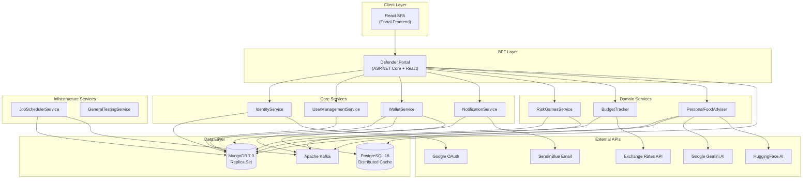
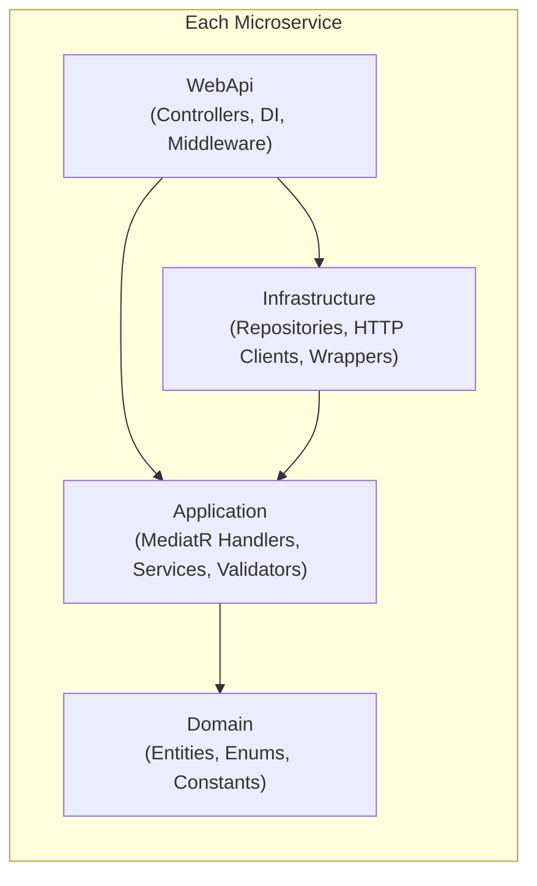
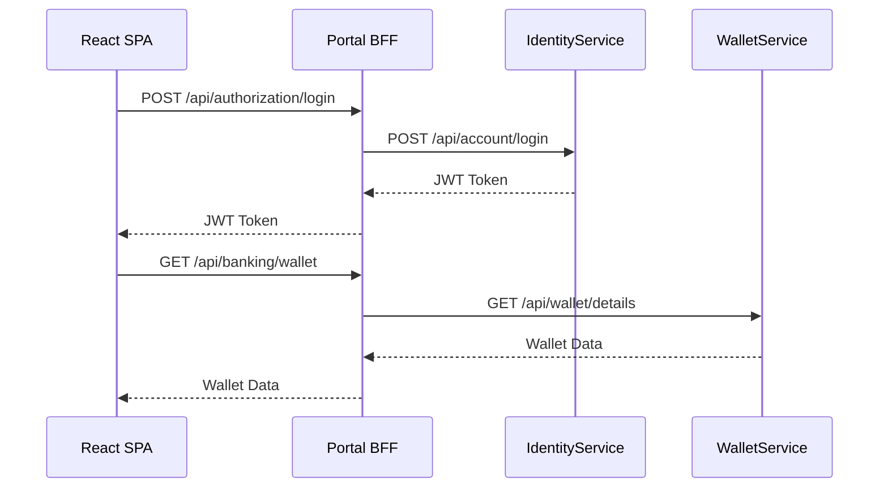
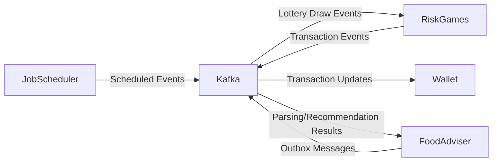
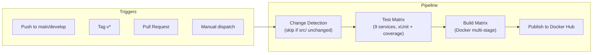

# Defender Platform -- Project Overview

*Last updated: March 5, 2026*

## Table of Contents

- [Introduction](#introduction)
- [High-Level Architecture](#high-level-architecture)
- [Technology Stack](#technology-stack)
- [Repository Structure](#repository-structure)
- [Services Catalog](#services-catalog)
- [Shared Libraries](#shared-libraries)
- [Portal Frontend](#portal-frontend)
- [Communication Patterns](#communication-patterns)
- [Data Storage](#data-storage)
- [Security](#security)
- [Infrastructure and Deployment](#infrastructure-and-deployment)
- [CI/CD Pipeline](#cicd-pipeline)
- [Developer Tooling](#developer-tooling)

---

## Introduction

Defender is a multi-service platform built as a .NET monorepo. It consists of 10 microservices, 3 shared libraries, a React SPA portal, and a full GitOps deployment pipeline. The platform provides identity management, wallet/banking, budget tracking, risk-based games (lotteries), notifications, personal food advising via AI, and job scheduling -- all orchestrated through a Backend-For-Frontend (BFF) portal.

---

## High-Level Architecture

The platform follows a microservices architecture with a BFF pattern. The Portal acts as the single entry point for end users, proxying requests to internal services. Services communicate synchronously via HTTP and asynchronously via Apache Kafka.



### Service Architecture (Clean Architecture)

Every service follows a four-layer Clean Architecture pattern, enforced via the service-template:



| Layer | Responsibility |
|-------|---------------|
| **Domain** | Entities implementing `IBaseModel`, enums, domain constants. No external dependencies beyond `Defender.Common`. |
| **Application** | MediatR command/query handlers, FluentValidation validators, application services, interface definitions for repositories and wrappers. |
| **Infrastructure** | MongoDB repositories extending `BaseMongoRepository<T>`, typed HTTP client wrappers, external API integrations. |
| **WebApi** | ASP.NET Core host, controllers extending `BaseApiController`, JWT authentication, Swagger, ProblemDetails middleware. |

---

## Technology Stack

| Category | Technology | Version |
|----------|-----------|---------|
| **Runtime** | .NET | 10.0 |
| **Language** | C# | Latest (nullable, implicit usings) |
| **Web Framework** | ASP.NET Core | 10.0 |
| **CQRS / Mediator** | MediatR | 14.0.0 |
| **Validation** | FluentValidation | 12.1.1 |
| **Object Mapping** | AutoMapper | 16.0.0 |
| **Database** | MongoDB | Driver 3.6.0, Server 7.0 |
| **Cache** | PostgreSQL (via Dapper) | Npgsql 10.0.1, Dapper 2.1.66 |
| **Messaging** | Apache Kafka | Confluent.Kafka 2.13.0 |
| **Authentication** | JWT Bearer | 10.0.2 |
| **Logging** | Serilog | 4.3.0 |
| **Error Handling** | Hellang.Middleware.ProblemDetails | 6.5.1 |
| **API Docs** | Swashbuckle (Swagger) | 10.1.0 |
| **Code Analysis** | Roslynator.Analyzers | 4.15.0 |
| **Testing** | xUnit + Moq + Coverlet | 2.9.3 / 4.20.72 / 6.0.4 |
| **Frontend** | React + TypeScript + MUI | 17.0.2 / 4.7.3 |
| **State Management** | Redux | (redux-thunk) |
| **Routing** | react-router-dom | v6 |
| **i18n** | i18next + react-i18next | |
| **Containers** | Docker (Alpine-based) | Multi-stage builds |
| **Orchestration** | Kubernetes + Helm | |
| **GitOps** | ArgoCD | |
| **CI/CD** | GitHub Actions | |
| **Package Management** | MSBuild Central Package Management | `Directory.Packages.props` |

---

## Repository Structure

```
Defender.MonoRepo/
├── .github/workflows/           # CI/CD pipelines
├── docs/                        # Project documentation
├── helm/
│   ├── argocd-applications/     # ArgoCD Application manifests (per env)
│   ├── argocd-config/           # ArgoCD server configuration
│   └── service-template/        # Shared Helm chart + per-service values
├── scripts/                     # Automation scripts (bash, PowerShell)
├── secrets/                     # Secret templates (gitignored)
├── src/
│   ├── Defender.BudgetTracker/
│   ├── Defender.Common/         # Shared library
│   ├── Defender.DistributedCache/  # Shared library
│   ├── Defender.GeneralTestingService/
│   ├── Defender.IdentityService/
│   ├── Defender.JobSchedulerService/
│   ├── Defender.Kafka/          # Shared library
│   ├── Defender.NotificationService/
│   ├── Defender.PersonalFoodAdviser/
│   ├── Defender.Portal/         # BFF + React SPA
│   ├── Defender.RiskGamesService/
│   ├── Defender.UserManagementService/
│   ├── Defender.WalletService/
│   ├── service-template/        # Scaffold for new services
│   ├── Directory.Build.props    # Shared MSBuild properties (net10.0)
│   ├── Directory.Packages.props # Centralized NuGet versions
│   ├── Dockerfile.Service       # Shared Dockerfile for WebApi services
│   ├── Dockerfile.Portal        # Dockerfile for Portal (includes Node.js)
│   ├── docker-compose.yml       # Local/dev infrastructure stack
│   └── Defender.Core.sln        # Umbrella solution
└── tools/
    ├── Defender.SecretManagementService/  # Secret CRUD via MongoDB
    └── Defender.SimpleMongoMigrator/      # Database migration tool
```

---

## Services Catalog

| Service | Port | Purpose | Key Dependencies |
|---------|------|---------|-----------------|
| **Defender.IdentityService** | 47050 | Authentication, JWT token issuance, Google OAuth, access codes, login history | Google APIs, UserManagement, Notification |
| **Defender.UserManagementService** | 47051 | User profile CRUD, role management, account blocking | Identity |
| **Defender.NotificationService** | 47052 | Email notifications (verification codes, general emails) via SendinBlue | SendinBlue API |
| **Defender.Portal** | 47053 | BFF gateway + React SPA. Proxies all user requests to internal services | All services, DistributedCache |
| **Defender.JobSchedulerService** | 47057 | Scheduled job execution via Kafka. Stores jobs in MongoDB, publishes events on schedule | Kafka |
| **Defender.WalletService** | 47058 | Multi-currency wallets, transactions, recharges, transfers | Kafka, DistributedCache |
| **Defender.GeneralTestingService** | 47059 | End-to-end regression testing (login, wallet, transfers). Not included in CI build | Portal, Identity |
| **Defender.RiskGamesService** | 47060 | Lottery games, draws, ticket purchasing, prize distribution | Kafka, Wallet |
| **Defender.BudgetTracker** | 47061 | Personal budget tracking, position management, exchange rates, diagrams | Exchange Rates API |
| **Defender.PersonalFoodAdviser** | 47062 | AI-powered menu parsing, dish extraction, personalized food recommendations | Gemini AI, HuggingFace, Kafka |

---

## Shared Libraries

### Defender.Common

The foundational shared library referenced by all services. Provides:

- **BaseMongoRepository\<T\>** -- Generic MongoDB repository with CRUD, filtering (`FindModelRequest<T>`), pagination (`PagedResult<T>`), and transaction support.
- **IBaseModel** -- Entity contract (`Guid Id` with BSON attributes).
- **MediatR Behaviors** -- `LoggingBehavior`, `UnhandledExceptionBehavior`, `ValidationBehavior` (pipeline behaviors for cross-cutting concerns).
- **Exception Hierarchy** -- `ServiceException`, `ValidationException`, `ForbiddenAccessException`, `NotFoundException`, `ApiException` with error codes.
- **Accessors** -- `ICurrentAccountAccessor`, `IAuthenticationHeaderAccessor` for extracting identity from JWT claims.
- **Secrets** -- `SecretsHelper` for reading secrets from environment variables or MongoDB.
- **Typed HTTP Clients** -- NSwag-generated clients for inter-service communication (Identity, UserManagement, Wallet, Notification, BudgetTracker, RiskGames, Portal).
- **Base Controller** -- `BaseApiController` with `IMediator`, `IMapper`, and `ProcessApiCallAsync` for standardized endpoint handling.

### Defender.Kafka

Kafka messaging abstractions built on Confluent.Kafka:

- **DefaultKafkaProducer\<T\>** -- Produces messages with idempotence (`Acks.All`, `EnableIdempotence = true`).
- **DefaultKafkaConsumer\<T\>** -- Subscribes to topics with configurable group IDs and message handlers.
- **KafkaRequestResponseService** -- Synchronous request-response pattern over Kafka using correlation IDs.
- **IKafkaEnvPrefixer** -- Environment-aware topic naming (e.g., `prod_TopicName`, `local_TopicName`).
- **EnsureTopicsCreatedService** -- Background service base class for topic initialization at startup.
- **JSON serialization** via custom `JsonSerializer<T>`.

### Defender.DistributedCache

PostgreSQL-backed distributed cache using Dapper:

- **IDistributedCache** -- Cache-aside pattern with `Add`, `Get` (with optional fetch delegate), `Invalidate`.
- **Expression-based lookups** -- Query cache by expressions rather than just keys.
- **TTL management** -- `PostgresCacheCleanupService` for background cache entry expiration.
- **Convention-based keys** -- `CacheConventionBuilder` for consistent key generation.

---

## Portal Frontend

The Portal frontend is a React 17 Single-Page Application served by the Portal's ASP.NET Core host.

| Aspect | Details |
|--------|---------|
| **Framework** | React 17 with TypeScript |
| **UI Library** | Material UI (MUI) |
| **State** | Redux with `createStore`, `combineReducers`, `redux-thunk` |
| **Routing** | react-router-dom v6 with lazy loading and `Suspense` |
| **i18n** | i18next with `react-i18next` |
| **Auth** | Google OAuth via `@react-oauth/google`, JWT stored in Redux/localStorage |
| **API** | `APICallWrapper` using native `fetch` with Bearer token injection |
| **Dev Proxy** | `setupProxy.js` proxies `/api/**` to ASP.NET Core backend |

### Frontend Pages

- **Account** -- Login, profile management, verification
- **Banking** -- Wallet operations, transactions
- **Budget Tracker** -- Position management, group management, diagrams
- **Games** -- Lottery participation and results
- **Food Adviser** -- Menu upload, AI-powered dish extraction and recommendations
- **Admin** -- User management, banking administration
- **Configuration** -- Health checks, system settings

---

## Communication Patterns

### Synchronous (HTTP)

The Portal (BFF) communicates with all backend services via NSwag-generated typed HTTP clients. Each client is registered in DI with `AddHttpClient<TClient, TImplementation>` and wraps calls in `ExecuteSafelyAsync` for error handling and auth header propagation.



### Asynchronous (Kafka)

Event-driven communication for decoupled workflows:



Key Kafka flows:
- **Job Scheduling**: `JobSchedulerService` publishes scheduled events (e.g., `ScheduleNewLotteryDraws`, `StartLotteriesProcessing`) to Kafka topics.
- **Lottery Processing**: `RiskGamesService` consumes job events, processes lottery draws, and publishes transaction events.
- **Wallet Updates**: `WalletService` consumes transaction status updates from Kafka.
- **Food Adviser Outbox**: `PersonalFoodAdviser` uses an outbox pattern with Kafka for menu parsing and recommendation processing.

---

## Data Storage

### MongoDB

Primary data store for all services. Each service uses its own logical database (derived from `MongoDbOptions.GetDatabaseName()`). All repositories extend `BaseMongoRepository<T>` from `Defender.Common`.

- **Local development**: MongoDB 7.0 single-node replica set (`rs0`)
- **Transactions**: Supported via `IClientSessionHandle` and `MongoTransactionHelper`
- **Secrets storage**: `ROSecretRepository` stores encrypted secrets in a shared MongoDB database

### PostgreSQL

Used exclusively for distributed caching via `Defender.DistributedCache`. Provides a `cache_database` with Dapper-based access and TTL cleanup.

---

## Security

### Authentication

- **JWT Bearer**: All services validate JWTs using a shared signing key (`Secret.JwtSecret` from `SecretsHelper`).
- **Google OAuth**: `IdentityService` validates Google tokens and issues platform JWTs.
- **Token Flow**: SPA authenticates via Google -> Portal -> IdentityService -> JWT returned to SPA.

### Authorization

- **Role-based**: `[Auth(Roles.Admin)]`, `[Auth(Roles.SuperAdmin)]` attributes on controllers.
- **Roles**: User, Admin, SuperAdmin (defined in `Defender.Common.Consts`).
- **Authorization Service**: `IAuthorizationCheckingService` validates access levels.

### Secrets Management

- **Environment variables**: Secrets injected via env files (`secrets.local.list`, `secrets.dev.list`) or Kubernetes secrets.
- **MongoDB-backed secrets**: `SecretsHelper` can fall back to reading encrypted secrets from MongoDB.
- **Encryption**: Secrets encrypted with `Defender_App_SecretsEncryptionKey`.
- **Secret Management Tool**: `tools/Defender.SecretManagementService` provides CRUD API for MongoDB-stored secrets.

---

## Infrastructure and Deployment

### Local Development (Docker Compose)

`src/docker-compose.yml` provides two profiles:

| Profile | Purpose | Config |
|---------|---------|--------|
| `local` | Full local stack with Kafka/Zookeeper | `secrets.local.list`, `ASPNETCORE_ENVIRONMENT=Local` |
| `dev` | Services pointing to remote infrastructure | `secrets.dev.list`, `ASPNETCORE_ENVIRONMENT=Dev` |

Infrastructure services (always running):
- **MongoDB 7.0** -- Replica set on port 27017
- **PostgreSQL 16** -- Cache database on port 5432
- **Zookeeper** -- Kafka coordination on port 2181 (local profile only)
- **Kafka** -- Message broker on port 9092 (local profile only)
- **Kafka UI** -- Web UI on port 8080
- **pgAdmin** -- Database admin on port 5050

### Docker Images

Two shared Dockerfiles using multi-stage Alpine-based builds:

- **Dockerfile.Service** -- For all WebApi services. Accepts `SERVICE_DIR` build arg to select the service.
- **Dockerfile.Portal** -- For the Portal. Includes Node.js for SPA build.

### Kubernetes + Helm

- **Shared Helm chart** at `helm/service-template/` with per-service value overrides (`values-identity.yaml`, `values-wallet.yaml`, etc.).
- **Resources**: 125m-250m CPU, 256Mi-512Mi memory per pod.
- **HPA**: Min 1, Max 2 replicas, target CPU 90%.
- **ConfigMap**: `ASPNETCORE_ENVIRONMENT: Prod` and service-specific settings.
- **Secrets**: `Defender_App_MongoDBConnectionString` and `Defender_App_SecretsEncryptionKey` from Kubernetes secrets.

### ArgoCD (GitOps)

- **Application manifests** in `helm/argocd-applications/dev/` -- one per service.
- **Config** in `helm/argocd-config/` -- projects, RBAC, ArgoCD server settings.
- **Sync**: ArgoCD watches the `helm/service-template/` chart with per-service value files and auto-syncs on changes.

---

## CI/CD Pipeline

### Build and Publish (`docker-build-publish.yml`)



- **Matrix**: 9 services built and tested independently (GeneralTestingService excluded).
- **Tests**: `dotnet test` with XPlat Code Coverage per service.
- **Images**: Published to Docker Hub as `defender.<service-name>`.
- **Tags**: Branch name, PR number, semver, SHA, `latest`, timestamped.

### Image Promotion (`promote-image-tag.yml`)

Manual workflow that updates `helm/service-template/values-*.yaml` with a specific image tag, commits, and pushes -- triggering ArgoCD sync.

---

## Developer Tooling

### Service Template

`src/service-template/` provides a scaffold for creating new services with the standard four-layer architecture, pre-configured DI, JWT auth, Swagger, ProblemDetails, and MongoDB repository patterns. See `docs/CREATE-NEW-SERVICE.md`.

### Scripts

| Script | Purpose |
|--------|---------|
| `generate-main-sln.sh` | Generates the umbrella `Defender.Core.sln` |
| `generate-argocd-apps.sh` | Generates ArgoCD Application manifests |
| `generate-service-matrix.sh` | Outputs service matrix for CI workflows |
| `promote-image-tag.sh` | Updates Helm values with a new image tag |
| `check-nuget-egress.sh` | Verifies NuGet.org is reachable before restore |
| `coverage-dashboard.ps1` | Generates test coverage dashboard |
| `validate-workflow-services.sh` | Validates CI service matrix consistency |

### Tools

- **SecretManagementService** -- Standalone service for managing MongoDB-stored encrypted secrets.
- **SimpleMongoMigrator** -- Database migration tool for MongoDB schema changes.
- **GeneralTestingService** -- End-to-end regression suite that exercises login, wallet, and transfer flows against the full stack.
