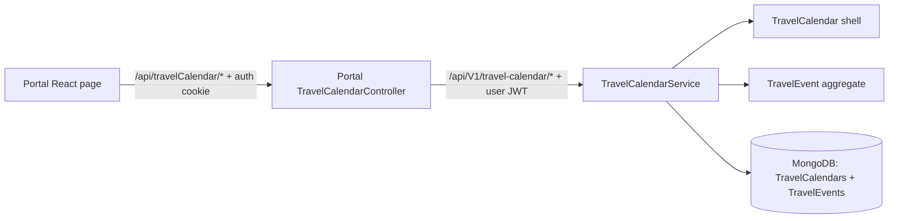

# Travel Calendar

## Scope and ownership

`Defender.TravelCalendarService` owns the authenticated user's Q3 2026 travel plan: scheduled events, must-visit queue, POIs, shared-event participants, vehicle settings, calculated budget, local page theme, and packing list. Portal is a BFF only and does not persist this domain.



Mongo database names follow `{Environment}_Defender_TravelCalendarService`; the collections are `TravelCalendars` and `TravelEvents`. A unique `ux_user_id` index enforces one personal calendar shell per account. Shared events are canonical roots keyed by event ID and event `Version`, with indexes on `OwnerUserId` and `Participants.UserId`. Personal theme/packing mutations use calendar `expectedVersion`; shared event edits and invitation responses use event `expectedVersion`. A stale request returns `409 TRAVEL_CALENDAR_VERSION_CONFLICT` and the UI refreshes before retry.

## Budget rules

Transport is server-derived as `distanceKm / 100 × 12 L × 6.60 PLN`, rounded to two decimals. Overnight trips include hotel, all event types include other cost, and the server returns canonical per-event and aggregate totals. The client computes only an editor preview.

## API

All service routes require the `User` role except `GET /health`.

| Method | Route | Behavior |
|---|---|---|
| GET | `/api/V1/travel-calendar` | Load or initialize the current user's snapshot |
| PATCH | `/theme` | Persist local light/dark preference |
| POST | `/queued-trips` | Add a must-visit destination |
| POST | `/events/from-date` | Create a weekday/day-trip or normalized weekend trip |
| PUT/DELETE | `/events/{id}` | Save drawer fields or remove/return to queue |
| POST | `/events/{id}/auto-schedule` | Pick the first non-overlapping weekend |
| POST/PATCH/DELETE | `/events/{id}/points[/{pointId}]` | Immediate POI operations |
| POST/DELETE | `/events/{id}/participants[/{participantUserId}]` | Invite or remove platform users from a shared event |
| PATCH | `/events/{id}/my-participation` | Accept or decline an invitation |
| POST/PATCH/DELETE | `/packing-items[/{itemId}]` | Packing checklist operations |

Validation is `422`, missing nested resources are `404`, overlap/no free slot/stale version are `409`, and stable error codes are returned in ProblemDetails `extensions.code`.

## Local operation

```powershell
dotnet test src/Defender.TravelCalendarService/Defender.TravelCalendarService.sln
docker compose -f src/docker-compose.yml --profile local up -d --build mongo_local local-travel-calendar-service local-portal
docker compose -f src/docker-compose.yml config
```

- Service: `http://localhost:47064`
- Swagger: `http://localhost:47064/swagger`
- Portal page: `http://localhost:47053/travel-calendar`
- Mongo: `local_Defender_TravelCalendarService.TravelCalendars`
- Shared events: `local_Defender_TravelCalendarService.TravelEvents`

## Deployment and rollback

CI builds `defendersd/defender.travel-calendar`. Argo CD application `travel-calendar` consumes `helm/service-template/values-travel-calendar.yaml`, with HTTP scale-to-zero enabled. Deploy the service before Portal. Roll back Portal and service image tags independently; aggregate schema is additive/versioned and this release has no destructive migration.
